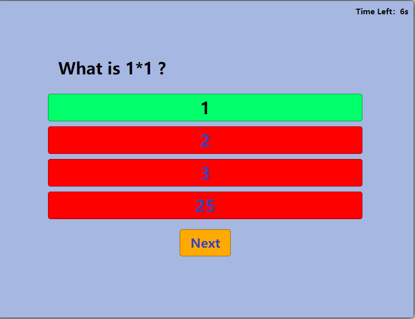
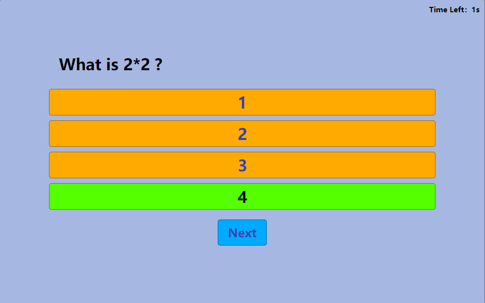

# Installation

Download quiz_game.js through [GitHub Repo](https://github.com/csc309-winter-2022/js-library-jinsiqi1.git).

Include quiz_game.js 
Include quiz_game.js in the html where you want to implement quiz game
```
<script defer type ="text/javascript" src='js/quiz_game.js'></script>
```

Include quiz_game.css (Optional)
You could include the default quiz_game.css and modify the featues and format. Or you could re-implement the style.
```
<link rel="stylesheet" type="text/css" href="styles/quiz_game.css" media="screen">

```

# Example

Easily modify question and answers game_quiz.js

Add questions and answers with correct indication in following pattern
```
var questions = {
        question0: {
            question: "What is 1+1 ?",
            answers: [
                { text: '1', correct: false },
                { text: '2', correct: true }
            ]
        },
        question1: {
            question: "What is the course number for Programming on Web ?",
            answers: [
                { text: 'csc111', correct: false },
                { text: 'csc333', correct: false },
                { text: 'csc309', correct: true },
                { text: 'csc888', correct: false }
            ]
        },
        question3: {
            question: "What is 2*2 ?",
            answers: [
                { text: '1', correct: false },
                { text: '2', correct: false },
                { text: '3', correct: false },
                { text: '4', correct: true }
            ]
        },
        question4: {
            question: "What is 6*6 ?",
            answers: [
                { text: '36', correct: true },
                { text: '2', correct: false },
                { text: '3', correct: false },
                { text: '25', correct: false }
            ]
        }
    }
```

Include quiz_game.js and quiz_game.css in the header
```
<!DOCTYPE html>
<html lang="en">

<head>
     <meta charset="UTF-8">
     <title>Quiz Game Demo</title>
     <!----load JS script-->
     <script defer type ="text/javascript" src='js/quiz_game.js'></script>
     <link rel="stylesheet" type="text/css" href="styles/quiz_game.css" media="screen">
</head>

</html>
```

Answers button 
<div id="answer-buttons" class="btn-grid">
                    <button class="btn">Example Answer a</button>
                    <button class="btn">Example Answer b</button>
                    <button class="btn">Example Answer c</button>
                    <button class="btn">Example Answer d</button>
               </div>

in html file
```
<div id="answer-buttons" class="btn-grid">
    <button class="btn">Example Answer a</button>
    <button class="btn">Example Answer b</button>
    <button class="btn">Example Answer c</button>
    <button class="btn">Example Answer d</button>
</div>
```
in quiz_game.css modify
```
.btn-grid {
  display: grid;
  grid-template-columns: repeat(1, auto); //modify button layout here
  //grid-template-columns: repeat(2, auto);
  gap: 10px;
  margin: 20px 0;
}
```


Control button "Start" and "Next" in html file
<div class="controls">
    <button id="start-btn" class="start-btn btn">Start</button>
    <button id="next-btn" class="next-btn btn hide">Next</button>
</div>

```
<div class="controls">
    <button id="start-btn" class="start-btn btn">Start</button>
    <button id="next-btn" class="next-btn btn hide">Next</button>
</div>
```

Display timmer in html
```
<span id="times"></span>
```


Display Result in html file
```
<div class="result" id="result"></div>
```

Change correct and wrong answer color in quiz_game.css in style folder
```
/*Default*/
:root {
  --hue-neutral: 400;
  --hue-wrong: 0;
  --hue-correct: 145;
}
```



```
/*Modified*/
:root {
  --hue-neutral: 200;
  --hue-wrong: 400;
  --hue-correct: 100;
}

```



