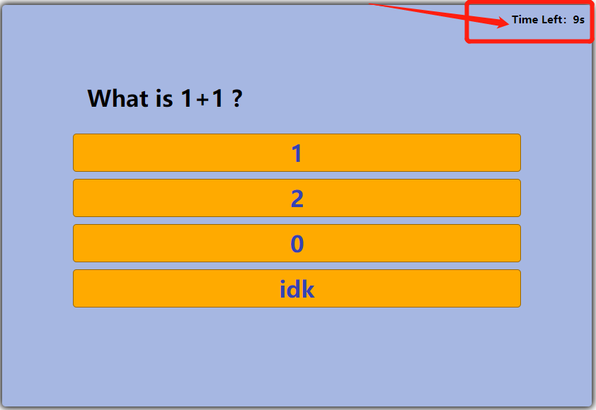
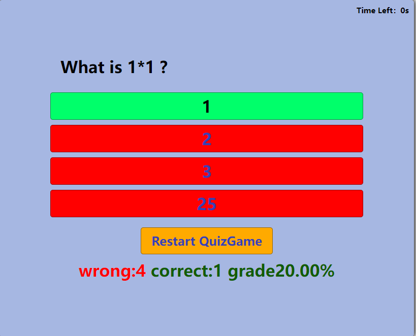

# Welcome to quiz_game.js Library

visit [GitHub](https://github.com/csc309-winter-2022/js-library-jinsiqi1.git) to view detailed code.

## quiz_game.js

A simple quiz game library allows developers to make quiz-type functionalities for any learning related website.

### intuitive game mode 
* Timmer implementation
* Right and wrong answer displayment
* One way quiz mode
* Restart the quiz
* Final grades result displayment
* Random question order to enhance learning

### User's Manual (Try it out in Demo Example)

Click "Start" to start the quiz game

After "Start", timmer will countdown, defult setting is 10s, developers are able to change the countdown timmer. When times up, quiz game will end nomatter if user finish the game_quiz or not

